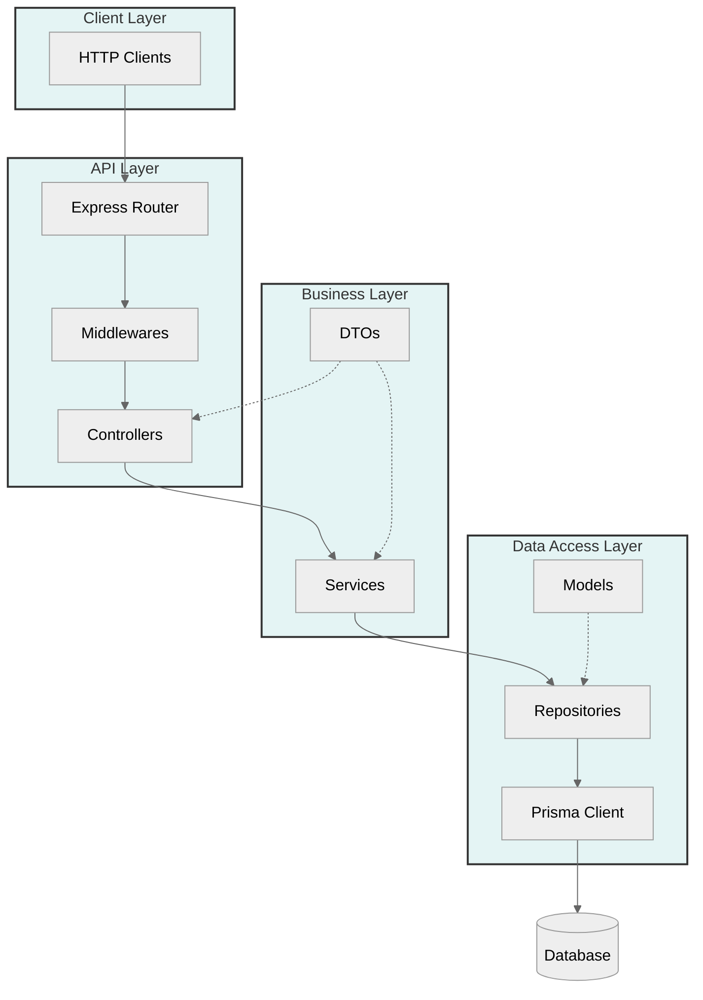

For Local Development:

1. Routes handle incoming HTTP requests
2. Controllers process the request and response
3. Services contain business logic
4. Repositories handle data access
5. Prisma manages database operations
